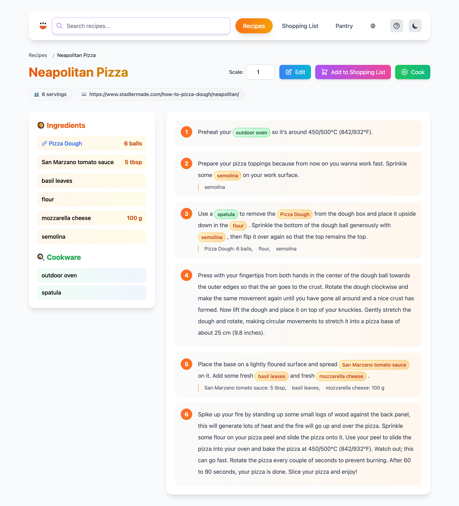
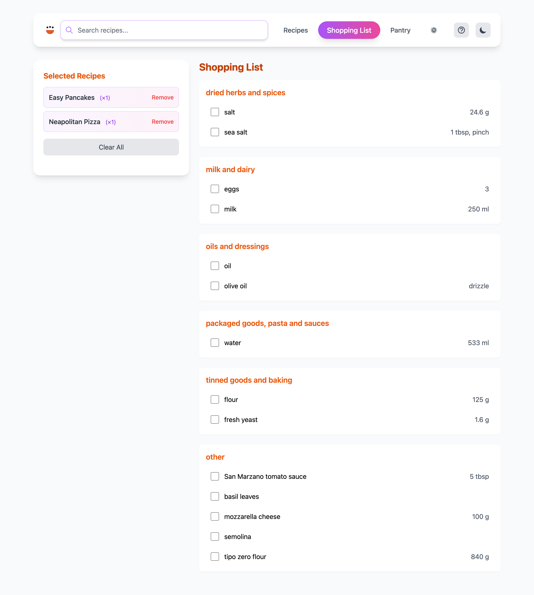
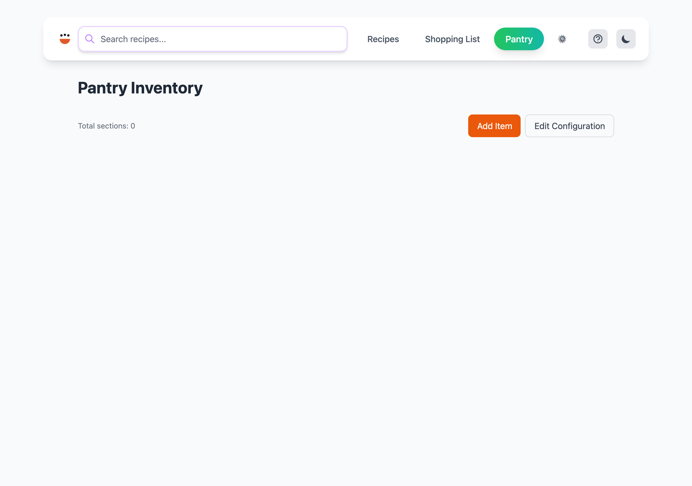

# Server Command

Start a local web server to browse and view your recipe collection.






## Usage

```
cook server [OPTIONS] [BASE_PATH]
```

## Arguments

| Argument | Description |
|----------|-------------|
| `[BASE_PATH]` | Root directory containing recipe files (default: current directory) |

## Options

| Option | Description |
|--------|-------------|
| `--host [<ADDRESS>]` | Allow connections from external hosts (default: localhost only). Optionally bind to a specific address. |
| `-p, --port <PORT>` | Port number (default: 9080) |
| `--open` | Automatically open the web interface in your default browser |

## Examples

```bash
# Start on localhost:9080
cook server

# Serve recipes from a specific directory
cook server ~/my-recipes

# Custom port with auto-open
cook server --port 8080 --open

# Allow access from other devices on the network
cook server --host
```

## Notes

- By default, only accepts connections from localhost
- Use `--host` on trusted networks only — recipes become accessible to anyone on the network
- The web interface supports recipe browsing, scaling, search, and shopping list management
- Mobile-friendly responsive layout
